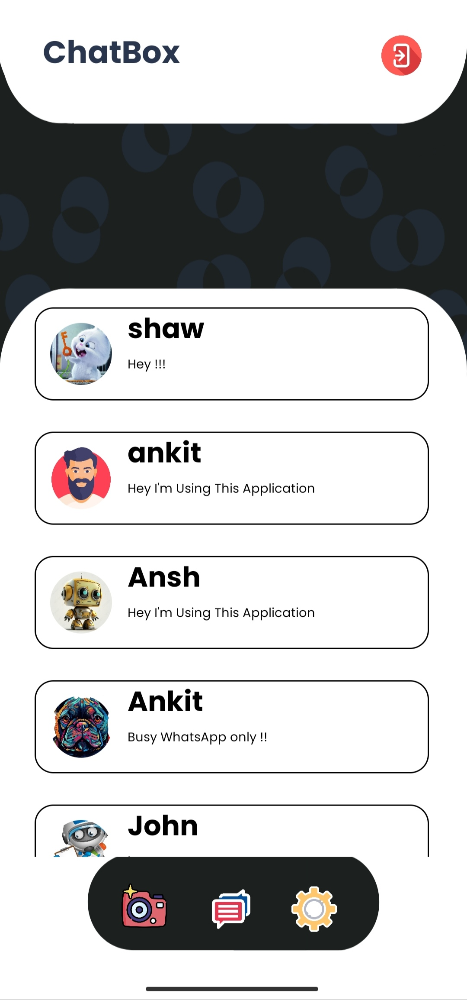
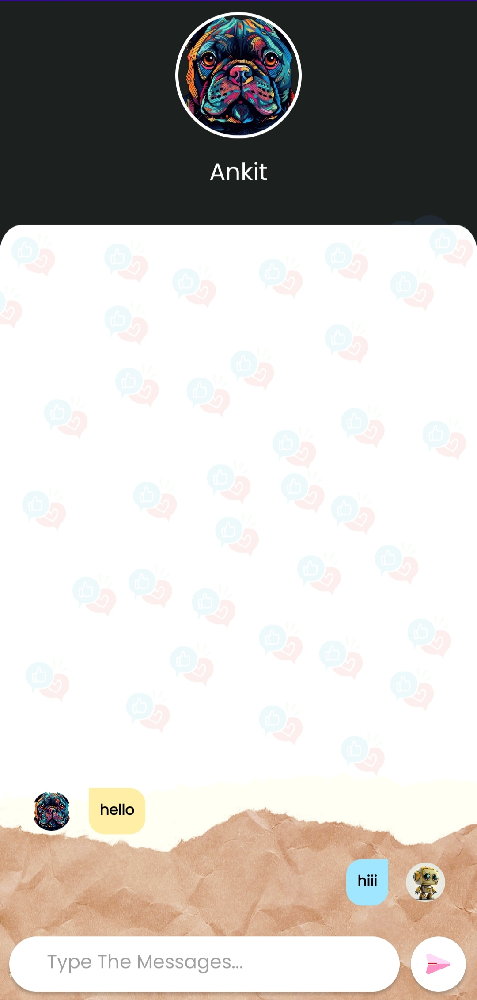

# ChatBox - Realtime Chat Application for Android

ChatBox is a feature-rich, real-time chat application developed for Android using Java and powered by Firebase for authentication and storage. This app is designed to provide a seamless and secure communication experience, allowing users to connect with friends and family in real-time. With a clean and intuitive user interface, ChatBox aims to enhance the way users engage in conversations on their Android devices.

## ✨Features

- Real-time Messaging:

  ChatBox leverages Firebase Realtime Database to ensure instant message delivery, providing users with a responsive and fluid chat experience. Messages are delivered in real-time, creating a dynamic and engaging communication environment.

- User Authentication:

  The app incorporates Firebase Authentication to ensure the security of user accounts. Users can sign up, log in, and reset passwords securely. User authentication plays a crucial role in maintaining the privacy and integrity of the conversations within the app.

- User Profiles

  ChatBox allows users to create and customize their profiles, adding a personal touch to their chat interactions. Users can set profile pictures and update their status, providing a more personalized and social experience.

## 🖼️ Screenshot

  
  
  
  

  
  
  
  

  
  
  
  

## 🛠️ Installation Step

- Download or clone the repo
- Build gradle and run the project

## 🚀 Getting Started
To get started with ChatBox, follow the steps outlined in the Installation Guide in the repository. Make sure to set up Firebase and configure the necessary credentials for authentication and storage.

## 🖥️ Technologies Used

- Android Studio
- Java
- Lottie Animation
- Firebase Realtime Database
- Firebase Authentication
- Firebase Cloud Messaging (FCM)
- Firebase Storage

## 🤝 Contributing
We welcome contributions from the open-source community. To contribute to ChatBox, please refer to the Contribution Guidelines for detailed information on how to submit bug reports, feature requests, and pull requests.

## © License
This project is licensed under the MIT License, making it open and accessible for everyone to use and contribute.

## Feel free to explore and enjoy ChatBox – Your go-to solution for real-time messaging on Android!
## 😃 If you liked the app, Please give it a ⭐ and fork the repository. 🙌  

